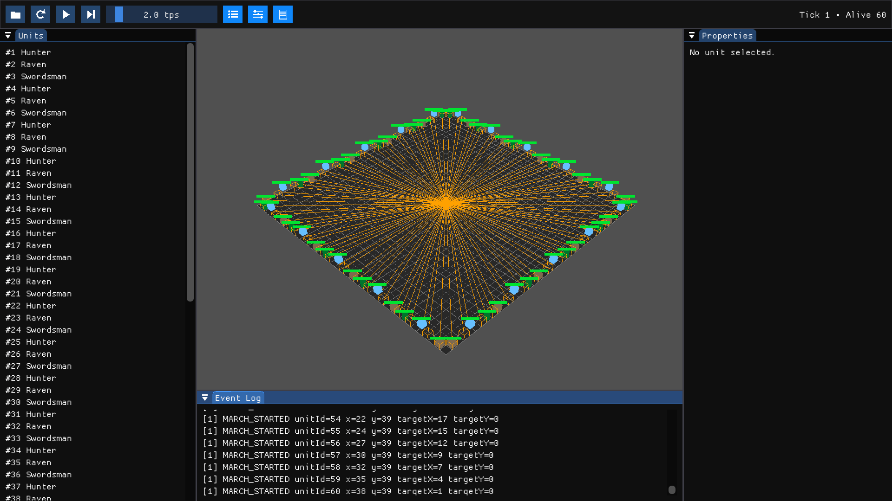

# Battle Test

Turn-based simulation of unit combat on a grid. See [TASK.md](TASK.md) for the assignment.



## CLI

```bash
cmake --workflow --preset release                       # configure && build
./build/release/sw_battle_test commands_example.txt     # run
```

## Visualizer

```bash
sudo apt install git libasound2-dev libgl1-mesa-dev libglu1-mesa-dev libx11-dev libxrandr-dev libxinerama-dev libxcursor-dev libxi-dev libwayland-dev libxkbcommon-dev   # deps
cmake --workflow --preset vis                            # configure && build
./build/vis/sw_visualizer commands_battle.txt            # run
```

Full build/run/test details: [BUILD_AND_RUN.md](BUILD_AND_RUN.md).
